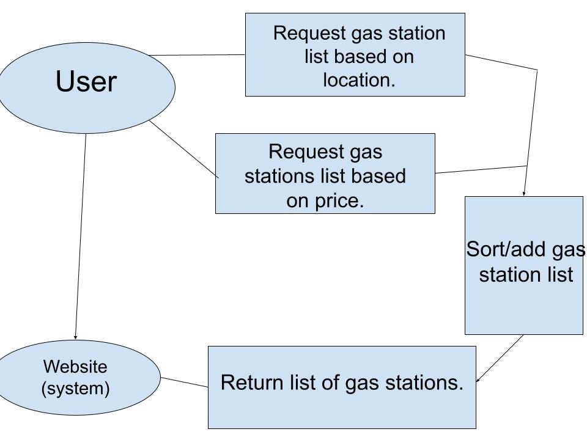

### 1. Positioning

### 2. Product Position Statement

### 3. Functional Requirements  

1. Must be able to return a list of gas locations based on price.  

2. Must be able to return a list of gas locations based on distance.  

3. User must be able to arrange list based on their preferences (alphabetical,
  proximity, etc.)  

4. User must be able to add to list.  

5. Must be able to accept data from an outside source (namely a bot made to
  collect gas station prices near the user).  

6. Users must be able to easily create and access a list of saved gas stations
from the list’s provided to them.

7. Users must be able to sort their created lists of gas stations.

8. Users must be able to overlay the data onto a map to help visualize the
information as sorted.

### 4.  Non-functional Requirements

1. Availability- Uptime should be 24/7/365, excluding any necessary maintenance.  
2. Performance- Accepting the incoming location data and sorting it by the set filter should only take up to ~30 seconds at most.  
3. Compatibility- Should be accessible on most OS’s and function via modern browsers.
4. Aesthetics- Should be both visually pleasing and functional, focusing on fast responses and low loading times over overly done visuals.  
5. Operability- The features should be easily identifiable and the user should be able to operate the website to create a list of gas stations organized by the desired sorting.  
6. Readability- Have a testing group of at least 10 people give feedback with at least 80% giving positive or neutral feedback.  
7. Reliability- Will use a trusted server to host the website/app that can ensure security and reliability for at least 80% of users.  

### 5.  Minimal Viable Product

Our goal is to create the code that will serve as the skeleton/backbone for the
completed project to be constructed on. A bare bones simple website/app that
works with fake location data from the user. The first thing we will need to do
is design a way to accept data from an outside source, when completed it needs
to be able to work with a hypothetical bot that can find the information the app
needs from various sources online. The second thing we need to make is a system
that can organize the incoming data in various ways, such as least costly gas
station to most costly or based on distance to the user. The last thing we need
is a bare bones interface where test users can interact with the application and
possibly save specific entries for later. To test/validate the app we will supply
some test users with sample data to feed into the app and let them test it out.
By testing the systems we can get feedback on what is working and what we need
to add/change.

### 6. User Cases  

#### 6.1 Use case diagram:  

  

#### 6.2 use case descriptions:  

**Use Case**: request nearby gas stations.  
**Actor**: website user.  
**Description**: the user will request gas stations based on proximity.  
**Preconditions**: No list of gas stations.  
**Postconditions**: Return list of gas stations.  
Main Flow:  

1. The actor requests a list of gas stations based on their proximity.  

2. After request, the system returns said list.

**Use Case**: request nearby gas stations.  
**Actor**: website user.  
**Description**: the user will request gas stations based on proximity.  
**Preconditions**: No list of gas stations.  
**Postconditions**: Return list of gas stations.  
Main Flow:  

1. The actor requests a list of gas stations based on prices (low or high).  

2. After request, the system returns said list.  

**Use Case**: Sort list  
**Actor**: webisite user  
**Description**: The user will sort the list based on their preferences.  
**preconditions**: Already has a list of gas stations.  
**Postconditions**: return a new list of gas stations.  
Main flow:  

1. The actor rearranges list based on other preferences.  

2. After request, the system returns said list.  

### 7. User stories  

Paul:  
1. As a truck driver, I want a list of all gas stations on my trip, so that
I can plan out my trip better.  

2. As a city driver, I want a list of the cheapest gas prices so that I don't
have to pay so much.  

Luke:  
1. As a DoorDash driver, I drive a different amount per day and I would like to
find the cheapest gas station near me wherever I may find myself.

2. As an Uber driver, I may find myself with a small amount of time between
pickups and I would like to find the cheapest gas stations near me so I can
plan out my next pickup easily.

Shlok:

### 8. Issue tracker  
