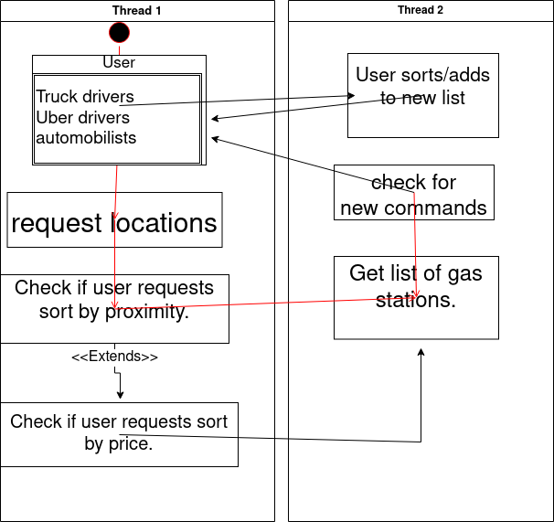

# 1. System Description  

## Description(brief):
To combat the expensive and variable gas prices, Gas Collector will arrange gas
stations in a profitably accessible way so that they can go out more. This can
be maintained with real-time prices and price alerts throughout the day. Gas
Collector will aggregate the best locations and prices for the average automobilist.  

## Key Requirements:
Website/app should <u>return</u> the <u>list</u> initially proposed by the **user** based on their
proximity and/or price. From there, the **user** should also be able to save and
customize the list to their preference. This data must also be compiled by an
algorithm and overlaid onto a map to visualize the information. This app must
also be easy to use and available 24/7. Ease of use means that the features and
options are easily identifiable but not bloated.

## Stakeholders:
Customers are not just for regular **car drivers**, they are also **truck drivers** and **uber drivers**. For example **uber** drivers could use Gas Collector to find the closest gas station after dropping off their client. Our clients would be insurance companies who would host advertisements to monetize our website.

## Paragraph about user stories
The project has various uses for different **users**, impacting their lives in different ways. For example a truck driver could plan ahead and plug in different locations around his route to plan out the best places to stop for gas. Another example would be a doordash driver who finds themselves low on gas in an unfamiliar part of the city, they could use the app to find the cheapest gas stations near them. Finally a college student could simply use the app to save on gas and help use that money to pay for other college expenses. Those aren't the only stories to be told either, the project itself has much more to offer to lots of different types of people.

## Use Cases
The website/app should function similarly for every **user**. The **user** puts in their location data to request a list of gas stations nearby. Then the website will retrieve the data and sort it by either price or distance as specified by the **user**. Finally it should return a list of different gas stations sorted as requested by the **user**. Alternatively the **user** may request that the website sorts the list in a different order or saves locations from the list for future use.

# 2. Model

