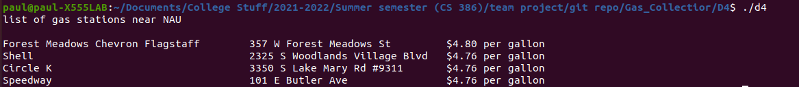

# 1. Introduction

To combat the expensive and variable gas prices, Gas Collector will arrange gas
stations in a profitably accessible way so that they can go out more. This can be
maintained with real-time prices and price alerts throughout the day. Gas Collector will
aggregate the best locations and prices for the average automobilist.  
Github:  
https://github.com/peterpalmer05/Gas_Collectior/tree/main  
Trello:  
https://trello.com/gascollectorworkshop

# 2. Implemented requirements
Requirement: As a student, I want a list of gas stations near NAU, so that I can see which is closer

Issue: https://trello.com/b/bIVNG2G8/issue-tracker  
Pull request: https://github.com/peterpalmer05/Gas_Collectior/commit/c4a0286e110a67f4da35da2b2a41c85fa3403545
Implemented by: Paul Mayoral  
Approved by: Paul Mayoral  
Print screen:

# 3. Adapted technologies

We picked up github, trello, slack, and firebase.  
When we started this project we decided to go with what we knew best, C and
adopted various editors to code with. On top of this we have been using a few
different services to share files and work on different aspects of the project
 together, the biggest example being google drive. We used google drive to work
 on the noncode aspects of the project and to record the meeting minutes in a way
 that allowed any member of the group to easily edit or contribute to these noncode sections.
 We also used GitHub to share and organize the coding files for our project and
 to get one place to store the different aspects of the code that we are working
 on. This allowed us to work on different aspects of the project separately and
 put them in place once finished. For example this was used to allow us to work
 on the functions that would be used for creating a table to display the information
 that a different set of functions would set up. For communication we used Slack
 to talk about how we are working on the project and different small issues we may
 be having. When we had meetings we used Zoom to host them and through Zoom we
 were able to have functional meetings even with large time zone differences.
 We are looking into using Firebase to help with deployment and are using
 Trello currently.

# 4. Learning Strategies

As the project is picking up we are finding ourselves with a lot of questions
about how to implement certain features of our app. Our biggest assets in
learning are google and youtube. We have been using these to find the answers
to small questions we may have and also to find tutorial series that can help
teach us how to create the GUI or how to integrate information from a document
for use as data in various aspects of our project.

# 5. Deployment

WWe are planning to use Firebase when we get our project out of the prototyping
phase to manage its deployment. Originally we were planning to use AWS to manage
 deployment and create a container but we all have used our student accounts for
 previous classes and so we do not all have access to the service at the moment.
 So instead we are going with Firebase as it is accessible and has features that
 are equivalent to AWS.

# 6. Licensing

Why we chose our license

We chose GNU General Public Use version 3 because it allows us to monetize our
product while also being open source.

# 7. Readme
Refer to Readme:

# 8. Look and Feel

For the prototype we are going with functionality over appearance. We are
currently working on getting the code for properly managing the data received
from an outside source, for the prototype this is a premade document but the
hypothetical completed project would use a bot to collect data on gas station
prices from the internet and store that data in a text document. So as such it
is important to us that we show we can get the data printed out into a console
in the minimum. However we have the groundwork for designing tables for display
in the console complete and the start of a proper GUI that will work on
minimalist principles to allow for ease of use.

# 9. Lessons Learned

After beginning work on this project we immediately began to learn a few
different lessons about the scope of the project we are working on. The first
thing that we struggled with was incorporating data from documents to be used
in the code. This is a weak point right now and is definitely going to be a focus
of effort in the future. The next thing that we learned is that the creation of
a visual GUI to display the data will take a considerable amount of effort to
learn how. This goes doubly so for creating a map with the gas station location
and prices listed on it accurately. Finally we learned that we need to back up
files to prevent unfortunate losses of time due to files being overwritten as
they are being worked on by GitHub. We must look into a better way to organize
our files in an effort to make our files safer as we work on them.

# 10. Demo
https://youtu.be/CB2e3hxSApI
