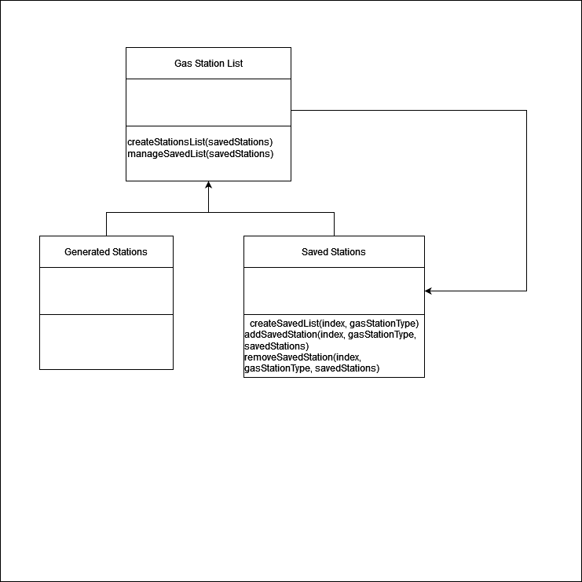

# 1. Description

Our system will display gas station locations based on proximity and/or price,
depending on user's preference. We will read from a txt file the user provides so that
our program can sort locations from this file. We may perhaps store these locations into a
linked list and perhaps arrange by bubbles sort. We will use the bubble sort
algorithm to arrange these locations as well.

# 2. Architecture

Our app relies on 2 parts, the actual app on a users device and servers to handle
the location data collection. The server functions to collect gas station data
based on the location data and the app manages that data and then displays it.
The arrows show direct connections between either classes in the direction the
arrows are leading. The different packages inside each of the larger more
encompassing ones represent the smaller parts that in total can substitute the
entirety of the package but individually cannot. Finally the diagram shows the
general process that the app will go through when used. From the user requesting
something from the interactive layer to the processing layer communicating with
the server to get necessary data and then organizing said data and sending it to
be displayed.  

# 3. Class Diagram

# 4. Sequence Diagram

use case description:  
users will share their location which the app will gather gas stations in relation
to this location based on their sorting preference. Afterwards  they can save these
locations or arrange the list.

# 5. Design  Patterns

Design Pattern: (Behavioral) Strategy
It allows the system to organize gas station data according to the user's choice
of either distance or price.

Design Pattern: (Structural) Composite

Both the generated list of gas stations and the preexisting list of saved gas
stations are treated as one object for the purpose of creating one larger list
and organizing it. The saved gas station list can be expanded upon by the larger
list that's created.  

# 6. Design Principles

SOLID principles gave us an excellent blueprint to make our code more manageable.
Considering our code we were able to cover most of the principles.
S: Single responsibility principle: Most of the classes in the project program
satisfy this principle of performing only one job per class. Classes like
“locationClass” handle the user's location and convert them into precise
coordination required for further calculations. Another class, importData
handles the input of the data entirely for the program.  
O: Open/close principle: Further research into the market, if the plan to add any
other features that would be done by adding a new class instead of modifying
any of the classes. The classes are restricted to performing very specific
functions in the program.  
L: Liskov substitution principle:  Trying to make the code more reusable,
although not a lot of features are added to the program, I think classes like
gatherData, sortAlphabetically and display output are readily available to reuse
and hence we satisfy this requirement.  
I: The sorting algorithms are bifurcated into another interface as they
shouldn’t be altered and are not required to make public to the users.  
D: Dependency inversion principle: We plan to adopt this principle in the future,
there are not so abstractions in the code that we can conclude that the code
successfully satisfies.  
