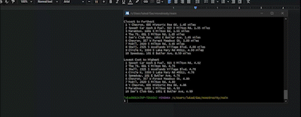

# 1. Introduction
	To aggregate the best gas stations for the user, we hope to read and store data 
about nearby gas stations into either a list or an array. We also hope to sort this 
data by distance or lowest price with other sorting methods possibly coming in the future. 
We want the user to get the most convenient locations and/or prices for themselves.  
	Currently our project is able to take in Data from outside sources in the form of a text file 
and sort that by distance and price. The GUI is only 3 buttons but they are fully functional and 
will display the data in the text file by either distance or price. It accomplishes this through
a bubble sort that is called whenever the user chooses their organization preference. The app 
is not fully self sufficient yet and must be ran through a console capable of displaying windows 
such as minGW through MSYS2. The console also needs GTK dependencies.  

	

https://github.com/peterpalmer05/Gas_Collectior  
https://trello.com/b/bIVNG2G8/issue-tracker

# 2. Implemented requirements

User Story:  
As a student, I want a list of gas stations near NAU, so that I can see which is closer.  
https://trello.com/c/3z8poPlW/4-as-a-student-i-want-a-list-of-gas-stations-near-nau-so-that-i-can-see-which-is-closer  
Paul Mayoral:  
https://github.com/peterpalmer05/Gas_Collectior/pull/29  
Implemented by: Paul Mayoral
Approved by: Paul Mayoral
(Note that this was as far as I could get with Linked List implementation)

### Paul Mayoral

User Story:
As a DoorDash driver, I drive a different amount per day and I would like to find the cheapest gas station near me wherever I may find myself.  
https://trello.com/c/RUH3yCa9/2-as-a-doordash-driver-i-drive-a-different-amount-per-day-and-i-would-like-to-find-the-cheapest-gas-station-near-me-wherever-i-may  
Luke Domby:https://github.com/peterpalmer05/Gas_Collectior/pull/33  
Implemented by: Luke Domby  
Approved by: Luke Domby  
(Attempted creation of a GUI for Gas Collector)  

User Story:
I am a student, I want to find the cheapest gas station in the town so that I can save for my college.  
https://trello.com/c/Yaaxy0NU/15-i-am-a-student-i-want-to-find-the-cheapest-gas-station-in-the-town-so-that-i-can-save-for-my-college-shlok-sheth  
https://github.com/peterpalmer05/Gas_Collectior/commit/45f1c2933cfb2312e7082cc004dbdd95017adde9  
Implemented by: Shlok-Milinkumar Sheth (submitted by Luke because of technical problems)    
Approved by: Luke Domby  
(Sorting methods were attempted to be created, Shlok had trouble with uploading)

### Luke Domby

# 3. Demo

# 4. Code Quality

	In general, we just used the basics for code quality. Such as indentation
and comments. Though we preferred not to use comments on every line, just the
minimum that was enough to convey what we were doing. We also tried to keep 
each line length bellow 82 characters and keep our functions in alphabetical order. 
We attempted to avoid global variables but due to time restraints we kept them in
with the goal to convert them to proper classes with constructors in the future.  

# 5.  Lessons Learned
	Time zone differences set other people back and hindered communication.
For instance Paul was going to sort data in linked lists after being told by his
peers that arrays would not help with our sorting methods only to turn out
arrays were better suited in the end for bubble sort.
This was because when Shlok relayed the latter bit of information to the group,
it was morning for him in India and evening for everyone else. Therefore Paul
had already worked on his code for about a day.  
	We struggled with the formatting of our code as well since most of use 
formatted our contributions to be their own main. To make matters worse after 
coming back to our code with clearer heads we discovered that we had overthought 
certain problems we were having. This caused us to get overwhelmed 
and cost us dearly. However, after a brief reprieve to work on D7, D8, and D9 we have figured 
out some solutions to our problems. In the future we should focus on better planning and 
communication to avoid these problems.  