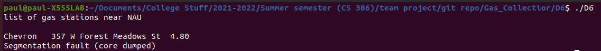
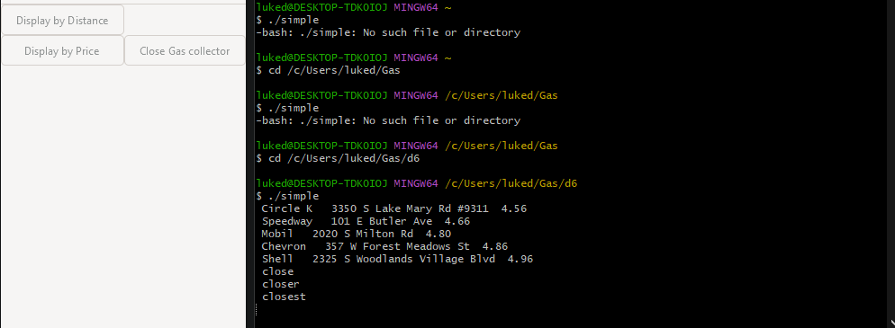
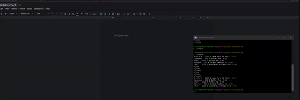

# 1. Introduction
To aggregate the best gas stations for the user, we hope to read and store data
about nearby gas stations into either a list or an array. We also hope to sort this
data alphabetically, lowest price or through other sorting methods. We want the user
to get the most convenient locations and/or prices for themselves.  

https://github.com/peterpalmer05/Gas_Collectior  
https://trello.com/b/bIVNG2G8/issue-tracker

# 2. Implemented requirements

User Story:  
As a student, I want a list of gas stations near NAU, so that I can see which is closer.  
https://trello.com/c/3z8poPlW/4-as-a-student-i-want-a-list-of-gas-stations-near-nau-so-that-i-can-see-which-is-closer  
Paul Mayoral:  
https://github.com/peterpalmer05/Gas_Collectior/pull/29  
Implemented by: Paul Mayoral
Approved by: Paul Mayoral
(Note that this was as far as I could get with Linked List implementation)

### Paul Mayoral

User Story:
As a DoorDash driver, I drive a different amount per day and I would like to find the cheapest gas station near me wherever I may find myself.  
https://trello.com/c/RUH3yCa9/2-as-a-doordash-driver-i-drive-a-different-amount-per-day-and-i-would-like-to-find-the-cheapest-gas-station-near-me-wherever-i-may  
Luke Domby:  
https://github.com/peterpalmer05/Gas_Collectior/pull/33  
Implemented by: Luke Domby  
Approved by: Luke Domby  
(Attempted creation of a GUI for Gas Collector)  

### Luke Domby

# 3. Demo

# 4. Code Quality

In general, we just used the basics for code quality. Such as indentation
and comments. Though we preferred not to use comments on every line, just the
minimum that was enough to convey what we were doing even if the code isn't
fully functional.  

# 5.  Lessons Learned
Time zone differences set other people back and hindered communication.
For instance Paul was going to sort data in linked lists after being told by his
peers that arrays would not help with our sorting methods only to turn out
arrays were better suited in the end for bubble sort.
This was because when Shlok relayed the latter bit of information to the group,
it was morning for him in India and evening for everyone else. Therefore Paul
had already worked on his code for about a day.  