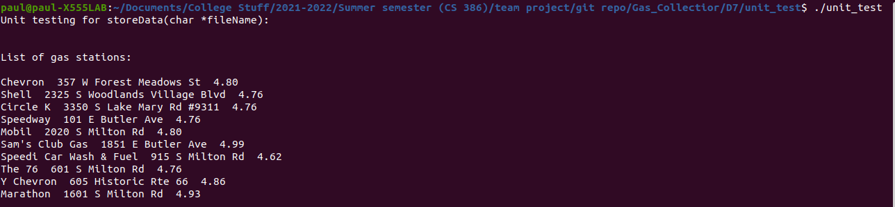
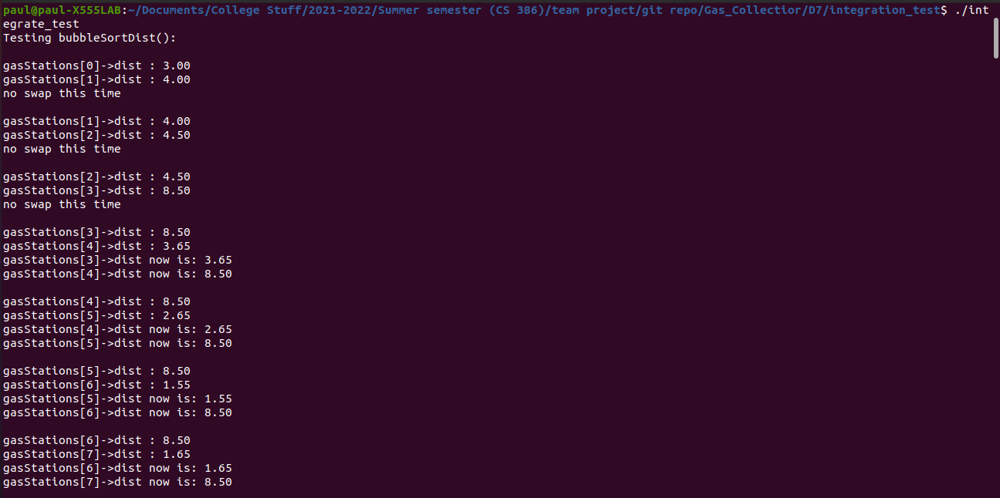
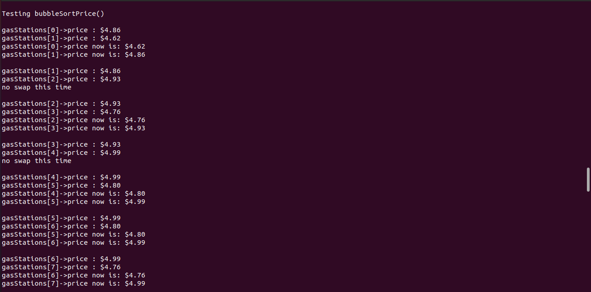

## 1. Introduction

**Gas Collector:**  
The purpose of our app is to aggregate the best gas stations for the user.
Currently we are able to read data from a file and sort that data. We can then
display that data back into the console. This is all done from a GUI made using
GTK and a console capable of displaying windows like minGW. The user is able to
supply their own data currently to the application by writing it into a text
file in the format as the example provided. Currently a user is able to interact
with the input data through two different sort buttons and can close the program
using the third and final button. All data is displayed through the console
currently.  

In the future we hope to increase the functionality of our application to meet
user expectations along with our initial value proposition. A few of the intended
features include the ability to get real time data depending on the input user
location, the capability to display gas station locations on a map visually, and
the ability to save specific gas stations for future use.  

## 2. Verification

### 2.1 Unit test

#### 2.1.1 Framework  
This code is all manual. We could not learn YAML script for github actions in time.  

#### 2.1.2 Test Link  
https://github.com/peterpalmer05/Gas_Collectior/blob/main/D7/unit_test/unit_test.c  

#### 2.1.3 Mock Objects
For mock objects we used gasStations.txt.  
https://github.com/peterpalmer05/Gas_Collectior/blob/main/D7/unit_test/gasStation.txt  
For each breakline it has information on Gas station name, address and price in that order.
This is the mock data used to test our function storeData();

#### 2.1.4 Screenshot  
  

### 2.2 Integration test

#### 2.2.1 Framework
As stated, this code is all manual.  

#### 2.2.2 Test Link
https://github.com/peterpalmer05/Gas_Collectior/blob/main/D7/integration_test/integrate_test.c  

#### 2.2.3 Test explanation
The test above tests the two bubble sort functions: bubbleSortPrice() and
bubbleSortDist(). These two functions are dependent on a lot of other functions:

#### 2.2.4 print screen and test log
  

  

See the full test log at:  
https://github.com/peterpalmer05/Gas_Collectior/blob/main/D7/integration_test/log.txt

### 2.3 Acceptance test

#### 2.3.1 Framework
As stated, no framework was used.  

#### 2.3.2 GUI and main file link
https://github.com/peterpalmer05/Gas_Collectior/blob/main/D6/GUI.c  
https://github.com/peterpalmer05/Gas_Collectior/blob/main/D6/main.c  

#### 2.3.3 GUI Test
For our acceptance test, we will be testing through our GUI. Output Unfortunately
can only be displayed through console.

#### 2.3.4 GUI video
https://raw.githubusercontent.com/peterpalmer05/Gas_Collectior/main/D7/acceptance_test.mp4

## 3. Validation  
**Script:**  
First guide them through installing minGW and msys:  
https://www.msys2.org/  

Ask ”How do you feel about installing mingW to launch the application?”

Then guide them through installing GTK dependencies:  
https://www.gtk.org/docs/installations/windows  
Ask “How do you feel about installing the dependencies for the app?” If the
feedback is the same, ask again after using the application and record responses.  

Guide them through changing directory to their download and launching the application.
Ask “How do you feel about launching the app after having to go through installation?”
Record what they interact with first and how much they choose to interact with the GUI.  

Ask “How do you feel about the concept of the app? How about its current functionality?”
Record their responses, especially the responses about what they would like to see.  

Ask “How do you feel about the design?” with the goal to get feedback on visuals.  

Ask ”How does interacting with the GUI feel?”  

Finally wrap up by showing how to uninstall requirements if necessary and while that is happening ask for any extra thoughts they may have.  

**3 users responses:**  
Cliff S.  

Q: How do you feel about installing mingW to launch the application?  
A: Using the console to launch and read results from the app is unfamiliar and off-putting.  

Q: How do you feel about installing the dependencies for the app?  
A: Installation process is too complicated and requires too much work.  

Q: How do you feel about launching the app after having to go through installation?  
A: Adding the dependencies is a lot of work for minimal reward.  

Q: How do you feel about the concept of the app? How about its current functionality?  
A: If it worked it would be an interesting concept that would be a handy app to have on hand.  
If it used real data the app would have a good use in reducing the cost of refueling the users car.  

Q: How do you feel about the design?  
A: Overly simplistic design of the GUI is not user friendly and gives off an air of suspicion.  

Q: How does interacting with the GUI feel?  
A: Using the two buttons to display lists of gas stations by the desired ordering
is easy but with it displayed in app rather than console.  

Zack  

Q: How do you feel about installing mingW to launch the application?
A: Suspicious and worried about the possibility of damaging the user's computer.

Q: How do you feel about installing the dependencies for the app?  
A: Unless I really wanted to, I would rather not, because I feel it should come
prepackaged and is too much work.  

Q: How do you feel about launching the app after having to go through installation?  
A: A lot of effort for little reward. Interacted with the app a few times and
left it open until the feedback session was done.  

Q: How do you feel about the concept of the app? How about its current functionality?  
A: Concept wise I appreciate the idea behind it, it would be more useful in a
past decade where the GUI would be more relevant. Some type of proper display on
map would be ideal.   

Q: How do you feel about the design?  
A: It does accomplish the job and it's easy to read with information displayed
easily. However the information could be displayed in a better fashion,
it's too bare bones.  

Q: How does interacting with the GUI feel?  
A: Interacting with the GUI is straightforward.   

Extras:
Would be interesting to add car mpg and it would show the most efficiently
priced gas station based on distance and price.  

Joey M.  

Q: How do you feel about installing mingW to launch the application?  
A: As a person unfamiliar with computer science I would be completely lost
without 1 on 1 guidance. Also if I didn’t know the person giving the instructions
I wouldn’t do this, it’s sketchy.  

Q: How do you feel about installing the dependencies for the app?  
A: For the outcome I don’t think it was worth it, it was just a lot.  

Q: How do you feel about launching the app after having to go through installation?  
A: Getting to the directory was difficult but if it was documented in a text file
it wouldn’t be too bad. Tested each button once and then left the app closed
after the close button worked.  

Q: How do you feel about the concept of the app? How about its current functionality?  
A: The concept is solid, especially right with the really high prices. Even
though it is going down a bit it would still be useful. Currently though it is
pretty janky and too barebones.   

Q: How do you feel about the design?  
A: Too bare bones and simple doesn't look polished.  

Q: How does interacting with the GUI feel?  
A: It was easy to work with and use.  

Extras:
A good change would be having the output show on the app screen instead of the
console. Having a better way to collect data instead of just a singular text
file, maybe use a bot to collect the user's current location. It’d be great if
it displayed on some sort of google map, especially to help with navigation. It
would also be nice to choose a different location apart from the current user’s
location for use in finding gas stations. Emphasizes the only reason he went
through with installing it is due to the pre-existing trust.  

**Results:**   
Users are not satisfied with the current state of visuals and installation
process. They also don’t like that they have to supply a text file for the
application.  

**Reflection:**  
Users are happy with the system for properly sorting gas stations and the lists
provided are accurate. They appreciated the GUI being responsive and working,
however they wished it was more visually appealing and displayed results in it
rather than in console. The user’s actions did produce results according to the
text file used but it did not come up with real time data and that was
disappointing. The system lacks depth and doesn’t display the data in as simple
a manner as desired. It also doesn’t have a fully functioning GUI capable of
saving specific gas stations. The biggest features missing are real time data
collection and a map to display that data on.  

As for how the users performed, it was a bit of a mixed bag. One user was able
to follow instructions without a problem to get the set up for the app running
but most others had to have direct intervention to get it working. Once
dependencies were correctly installed and the app opened there were little
problems. Users were able to identify what button did what easily and were able
to use the system quite well once past that point. Unfortunately while most users
were able to use the app we have not fully completed our value proposition. The
app is not capable of displaying the information in an easily accessible manner
without a long set up time. On top of that it cannot get the data needed to
display real time local data. However, this is a step in the right direction and
with more time we could fully complete the value proposition.  
